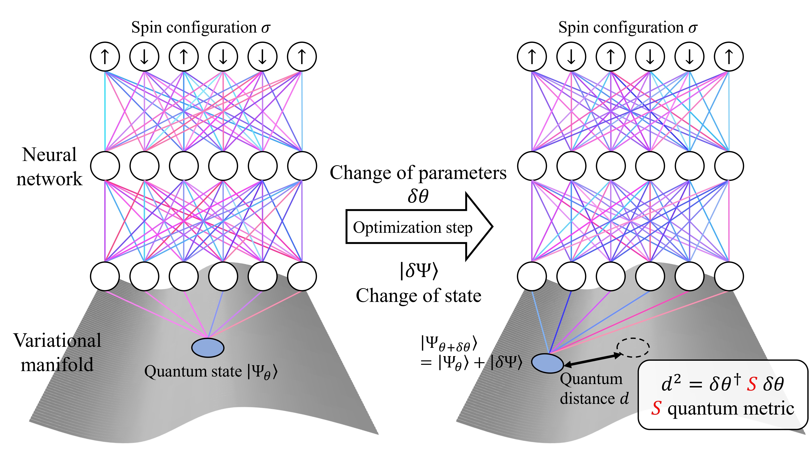
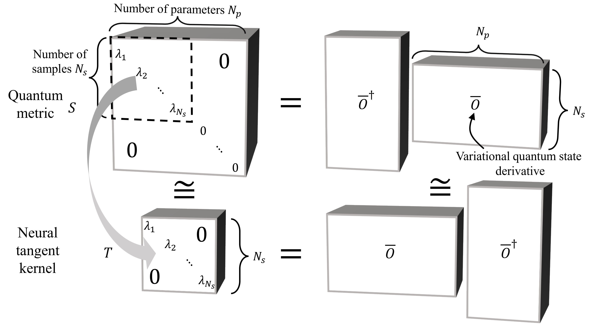

# MinSR
Repository for the paper

_Empowering deep neural quantum states through efficient optimization_

Related links:
- Article (not yet published)
- [Preprint](https://arxiv.org/abs/2302.01941) (not up-to-date)
- [GitHub](https://github.com/ChenAo-Phys/MinSR)
- [Zenodo](https://zenodo.org/doi/10.5281/zenodo.7657551)

## Contents

- Images
- Data
- Quantax, a package for reproducing results in the paper
- Tutorials for Quantax
- Examples to train networks and measure the variational energy
- Network parameters on the $10 \times 10$ square lattice at $J_2 / J_1 = 0.5$

## Quantax Installation

(Many thanks to Marin Bukov @mgbukov for the help with QuSpin)

### Step 1 - Create a conda environment

#### Step 1.1 - Requirement file

Download [quspin-linux_reqs.txt](quspin-linux_reqs.txt)

#### Step 1.2 - Create environment

In the folder of `quspin-linux_reqs.txt`

`conda create -n quantax --file quspin-linux_reqs.txt`
(you are free to choose other environment names)

Step 1.3 - Activate environment

`conda activate quantax`

### Step 2 - Install QuSpin
Quantax relies on the dev_0.3.8 branch of QuSpin, which can't be easily installed
through pip or conda. Follow the instruction below for manual installation.

#### Step 1.1 - Clone the dev_0.3.8 branch of QuSpin

`cd ~` (or choose a folder you want to clone the repository)

`git clone -b dev_0.3.8 https://github.com/QuSpin/QuSpin.git`

`cd QuSpin`

#### Step 1.2 - Install QuSpin

`python setup.py install build_ext -i --omp`

This will take some time and show many harmless warnings.

#### Step 1.3 - Possible problem

Try `import quspin` in a jupyter notebook. The manually installed QuSpin may raise circular import error. This problem can be solved by copying the quspin source code into `site-packages` of the conda environment and replacing the installed QuSpin files.

### Step 2 - Install Quantax

#### Step 2.1 - Install jax

Install `jax-0.4.25` according to the [guidance](https://jax.readthedocs.io/en/latest/installation.html)

#### Step 2.2 - Clone the repository

`cd ~` (or choose a folder you want to clone the repository)

`git clone https://github.com/ChenAo-Phys/MinSR.git`

`cd MinSR`

#### Step 2.3 - Install Quantax

`pip install .`

### Supported platforms
- CPU
- Nvidia GPU

### Parallelism
- Quantax can work only if all devices are on the same node
- Multiple-node compatibility is to be implemented

## Questions?
For any questions, bugs, or suggestions, please raise an issue in GitHub.
